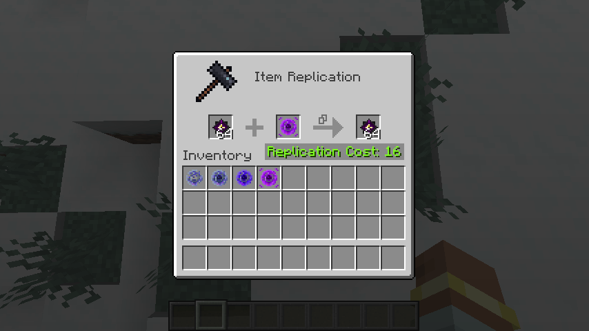

# RepliCore

[中文](README.md)

## Basic Gameplay

1. Added replication cores of **different qualities** to copy items under various conditions.
2. Defeating the **Ender Dragon** automatically grants **all nearby players** materials to craft replication cores: **Dragon Soul Crystal**. Drops **3** on the first kill and **1** on subsequent kills (configurable in the settings file).
3. Replicating items requires a **Replication Table**. Each replication consumes **experience levels**, calculated based on the **item count** and **number/levels of enchantments** (configurable in the configuration file).
4. **Experience cost formula**: `Final Cost (rounded up) = Item Count × Item Cost + Sum of (Enchantment Level × Enchantment Cost)`

---

## Screenshots



---

## Configuration Guide

```json5
{
  // Enable blacklist
  "blacklistEnabled": false,
  // Replication blacklist
  "blacklist": [
    // "Item ID"
    "item_id",
    "item_id2"
  ],
  // Dragon Soul Crystal drop count (post-first kill)
  "crystalDroppingCount": 1,
  // Dragon Soul Crystal drop count (first kill)
  "firstCrystalDroppingCount": 3,
  // Max drop range for crystals (blocks)
  "maxDropDistance": 256,
  // Cost settings
  "costConfig": {
    // Default item cost
    "defaultCost": 0.25,
    // Custom item costs
    "customCosts": {
      // "Item ID": Cost
      "item_id": 0.5,
      "item_id2": 1.0
    },
    // Enable enchantment cost calculation
    "calculateEnchantmentCosts": true,
    // Default enchantment cost
    "defaultEnchantmentCost": 2.0,
    // Ignore cursed enchantments
    "ignoreCurses": true,
    // Custom enchantment costs
    "customEnchantmentCosts": {
      // "Enchantment ID": Cost
      "enchantment_id": 1.0,
      "enchantment_id2": 1.5
    }
  }
}
```