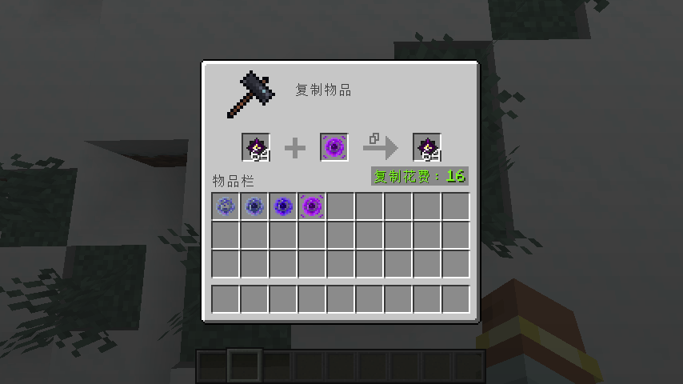

# 复制核心

## 基础玩法

1. 增加了几种不同品质的复制核心，可以用于复制不同条件下的物品。
2. 击败**末影龙**后自动给予**附近所有玩家**用于合成复制核心的材料：**龙魂结晶**。首次掉落3个，后续默认掉落1个，可在配置文件中修改。
3. 复制物品需要在**复制台**上操作，每次复制需要花费一定的经验等级，根据复制物品的**数量及其附魔的数量和等级**来计算最终所消耗的等级，可在配置文件中修改。
4. 复制物品所需等级计算公式：`最终等级（向上取整） = 物品数量 × 物品费用 + 物品每个附魔的等级乘以对应附魔费用的总和`

---

## 截图



---

## 配置文件介绍

```json5
{
  //启用黑名单
  "blacklistEnabled": false,
  //复制黑名单
  "blacklist": [
    //"物品ID"
    "item_id",
    "item_id2"
  ],
  //龙魂结晶掉落数量
  "crystalDroppingCount": 1,
  //龙魂结晶首次掉落数量
  "firstCrystalDroppingCount": 3,
  //龙魂结晶掉落范围
  "maxDropDistance": 256,
  //费用配置
  "costConfig": {
    //默认费用
    "defaultCost": 0.25,
    //自定义费用
    "customCosts": {
      //"物品ID": 费用
      "item_id": 0.5,
      "item_id2": 1.0
    },
    //计算附魔费用
    "calculateEnchantmentCosts": true,
    //默认附魔费用
    "defaultEnchantmentCost": 2.0,
    //忽略诅咒附魔
    "ignoreCurses": true,
    //自定义附魔费用
    "customEnchantmentCosts": {
      //"附魔ID": 费用
      "enchantment_id": 1.0,
      "enchantment_id2": 1.5
    }
  }
}
```